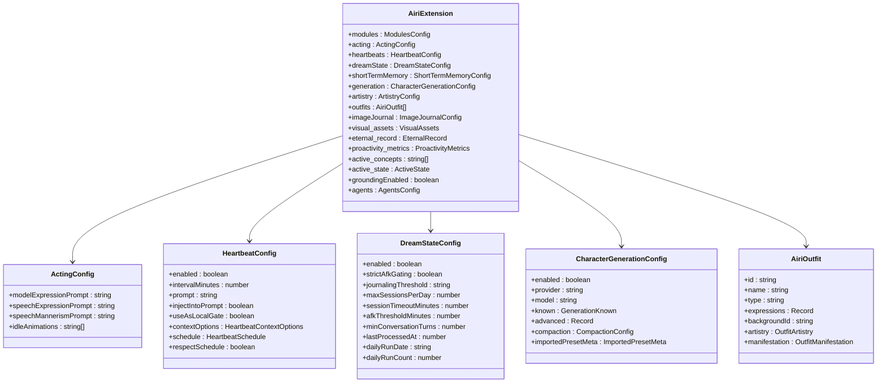

# AIRI Card System — Design Document

## Overview

Port the expanded AIRI card system from the [dasilva333/airi fork](https://github.com/dasilva333/airi) into our upstream codebase. The fork treats AIRI cards as a real character-management system with multi-tab configuration, import/export for both AIRI-native JSON and SillyTavern chara_card_v2 PNG, and per-card driving of model/stage/presentation state. Our current implementation is a thin metadata form with minimal extension fields.

## Architecture Decision Record

| Decision                     | Choice                                                                           | Rationale                                                                     |
| ---------------------------- | -------------------------------------------------------------------------------- | ----------------------------------------------------------------------------- |
| Type system location         | `packages/stage-ui/src/stores/modules/airi-card.ts`                              | Same as fork; keeps config types co-located with the store that consumes them |
| Import/export logic location | `packages/stage-pages/src/pages/settings/airi-card/index.vue`                    | Same as fork; page-level functions that operate on the store                  |
| CardImportWizard             | New component in `packages/stage-pages/src/pages/settings/airi-card/components/` | Fork pattern; wizard is a standalone component emitted from the index page    |
| PNG chunk utilities          | Inline in index.vue initially                                                    | Fork keeps them local; extract to shared util only if reuse emerges           |
| Store persistence            | `useLocalStorageManualReset` with custom `mapEntriesSerializer`                  | Fork pattern; handles Map serialization and background data stripping         |
| Tab structure                | Multi-tab in CardCreationDialog + CardDetailDialog                               | Fork pattern; Acting, Modules, Artistry, Proactivity tabs                     |

## Data Model Changes

### New Config Types

All new types live in [`packages/stage-ui/src/stores/modules/airi-card.ts`](packages/stage-ui/src/stores/modules/airi-card.ts).



### AiriExtension Field Diff

| Field                                     | Upstream      | Fork                                                              | Notes                              |
| ----------------------------------------- | ------------- | ----------------------------------------------------------------- | ---------------------------------- | ---------------------- |
| `modules.consciousness.moduleConfigs`     | ❌ missing    | ✅ `Record<string, any>`                                          | Per-model config overrides         |
| `modules.speech.pitch/rate/ssml/language` | ❌ missing    | ✅ added                                                          | Speech tuning params               |
| `modules.vrm`                             | ❌ missing    | ✅ `{source?, file?, url?}`                                       | VRM model reference                |
| `modules.live2d`                          | ❌ missing    | ✅ `{source?, file?, url?, activeExpressions?, modelParameters?}` | Live2D model reference             |
| `modules.displayModelId`                  | ✅ exists     | ✅ exists                                                         | Same                               |
| `modules.activeBackgroundId`              | ✅ `string`   | ✅ `string                                                        | null`                              | Fork makes it nullable |
| `modules.selectedModelId`                 | ❌ missing    | ✅ `string`                                                       | Legacy migration key               |
| `modules.active_expressions`              | ❌ missing    | ✅ `Record<string, number>`                                       | Unified expression map             |
| `modules.artistry`                        | ✅ in modules | ✅ moved to top-level                                             | Fork moves artistry out of modules |
| `acting`                                  | ❌ missing    | ✅ `ActingConfig`                                                 | Three-layer prompt system          |
| `heartbeats`                              | ❌ missing    | ✅ `HeartbeatConfig`                                              | Proactivity heartbeat system       |
| `dreamState`                              | ❌ missing    | ✅ `DreamStateConfig`                                             | Dream state / AFK processing       |
| `shortTermMemory`                         | ❌ missing    | ✅ `ShortTermMemoryConfig`                                        | Memory config                      |
| `generation`                              | ❌ missing    | ✅ `CharacterGenerationConfig`                                    | Per-card generation settings       |
| `outfits`                                 | ❌ missing    | ✅ `AiriOutfit[]`                                                 | Visual state outfits               |
| `imageJournal`                            | ❌ missing    | ✅ `{selfie: boolean}`                                            | Image journal toggle               |
| `visual_assets`                           | ❌ missing    | ✅ `Record<string, VisualAsset>`                                  | Named visual assets                |
| `eternal_record`                          | ❌ missing    | ✅ `{relational_milestones, lore_bits}`                           | Persistent character memory        |
| `proactivity_metrics`                     | ❌ missing    | ✅ `{ttsCount, sttCount, chatCount, totalTurns}`                  | Runtime proactivity stats          |
| `active_concepts`                         | ❌ missing    | ✅ `string[]`                                                     | Active concept tracking            |
| `active_state`                            | ❌ missing    | ✅ `{displayModelId, activeBackgroundId, active_expressions}`     | Runtime visual state               |
| `groundingEnabled`                        | ❌ missing    | ✅ `boolean`                                                      | Grounding toggle                   |

### Artistry Migration

The fork moves `artistry` from `modules.artistry` to a top-level `AiriExtension.artistry` field and adds:

| New Artistry Field         | Type                  | Purpose                                          |
| -------------------------- | --------------------- | ------------------------------------------------ |
| `autonomousMonitorEnabled` | `boolean`             | Monitor context for autonomous artistry triggers |
| `autonomousHistoryDepth`   | `number`              | How many history turns to consider               |
| `options`                  | `Record<string, any>` | Provider-specific JSON config                    |

The upstream `modules.artistry.workflowId` field is NOT in the fork. Our current code has `LegacyArtistrySettings` handling in [`CardCreationDialog.vue`](packages/stage-pages/src/pages/settings/airi-card/components/CardCreationDialog.vue:30) — this must be preserved during migration.

## Component Architecture

### Card Page Index

[`packages/stage-pages/src/pages/settings/airi-card/index.vue`](packages/stage-pages/src/pages/settings/airi-card/index.vue) grows significantly. The fork adds:

- Import/export functions: `exportCard`, `exportCardPng`, `buildCharaCardV2`, `getCardWithExportedBackground`
- PNG utilities: `parsePngCharaPayload`, `composeCardExportPng`, `injectPngTextChunk`, `createPngTextChunk`, CRC32 helpers
- Import normalization: `parseImportedCard`, `addCardPreviewNormalize`, `parseStMessageExamples`
- Card browser/wizard state: `activeBrowserSource`, `isImportWizardOpen`, `importedCardData`
- Electron IPC handler: `handleCharaCardDownloaded`
- Sorting/filtering: `searchQuery`, `sortOption`, `filteredCards`, `sortedFilteredCards`

```mermaid
flowchart TD
    A[Card Index Page] --> B[CardListItem]
    A --> C[CardCreationDialog]
    A --> D[CardDetailDialog]
    A --> E[CardImportWizard]
    A --> F[DeleteCardDialog]
    A --> G[ConceptBuilderModal]
    A --> H[FieldAiGeneratorModal]

    B -->|@export-json| I[exportCard]
    B -->|@export-png| J[exportCardPng]
    B -->|@activate| K[activateCard]

    E -->|@import| L[addCard + normalize]
    C -->|@save| M[saveCard via store]
    D -->|@edit| C
```

### CardCreationDialog Tabs

The fork expands [`CardCreationDialog.vue`](packages/stage-pages/src/pages/settings/airi-card/components/CardCreationDialog.vue) from a simple form to a multi-tab editor:

| Tab             | Fields                                                                                                            | New vs Existing                                       |
| --------------- | ----------------------------------------------------------------------------------------------------------------- | ----------------------------------------------------- |
| **Description** | name, description, personality, systemPrompt, postHistoryInstructions, scenario, greetings, messageExamples       | Existing — same as upstream                           |
| **Acting**      | modelExpressionPrompt, speechExpressionPrompt, speechMannerismPrompt, idleAnimations, speech capabilities loading | **NEW**                                               |
| **Modules**     | consciousness provider/model, speech provider/model/voice, display model, background, VRM/Live2D model refs       | Expanded — upstream has some but fewer                |
| **Artistry**    | provider, model, promptPrefix, widgetInstruction, spawnMode, autonomous settings, config JSON                     | Expanded — moved from modules, more autonomous fields |
| **Proactivity** | heartbeats config, dreamState, grounding                                                                          | **NEW**                                               |
| **Generation**  | provider, model, maxTokens, temperature, topP, contextWidth, reasoningFallback, compaction, advanced JSON         | **NEW**                                               |

### CardImportWizard

**NEW component** — [`CardImportWizard.vue`](packages/stage-pages/src/pages/settings/airi-card/components/CardImportWizard.vue) is a multi-step wizard:

1. **Step 1**: Name + display model selection
2. **Step 2**: Consciousness provider/model
3. **Step 3**: Speech provider/model/voice
4. **Step 4**: Toggles — artistry autonomous, dream state, proactivity
5. **Finalize**: Build card from imported data + wizard selections, emit `@import`

### CardDetailDialog

[`CardDetailDialog.vue`](packages/stage-pages/src/pages/settings/airi-card/components/CardDetailDialog.vue) gets expanded tabs matching the creation dialog tabs for read-only detail viewing.

## Store Changes

### airi-card.ts Store Diff

| Function                      | Upstream                         | Fork                                                              | Change                                                                                  |
| ----------------------------- | -------------------------------- | ----------------------------------------------------------------- | --------------------------------------------------------------------------------------- |
| `addCard`                     | Sync, `cards.value.set()`        | **Async**, imports embedded background data, uses `compactCard()` | Must become async; background import from data URL                                      |
| `removeCard`                  | `cards.value.delete()` + posthog | `new Map()` pattern                                               | Fork uses immutable Map updates                                                         |
| `updateCard`                  | Direct merge + `newAiriCard()`   | Direct merge + `compactCard()`                                    | Fork uses compactCard instead of newAiriCard                                            |
| `toggleGrounding`             | ❌ missing                       | ✅ new                                                            | Toggle grounding on a card                                                              |
| `setAutonomousArtistry`       | ❌ missing                       | ✅ new                                                            | Set autonomous artistry enabled                                                         |
| `syncCardState`               | ❌ missing                       | ✅ new                                                            | Sync card extensions to consciousness/speech/stage/display/live2d/vrm/background stores |
| `activateCard`                | Simple `activeCardId = id`       | Calls `syncCardState()`                                           | Activation now drives whole presentation                                                |
| `resolveAiriExtension`        | ~108 lines                       | ~261 lines                                                        | Much more comprehensive defaults                                                        |
| `newAiriCard`                 | ~44 lines                        | ~73 lines                                                         | More fields, normalization                                                              |
| `buildSystemPrompt`           | ❌ missing                       | ✅ new                                                            | Build system prompt from card data                                                      |
| `compactCard`                 | ❌ missing                       | ✅ new                                                            | Strip large data for storage                                                            |
| `stripEmbeddedBackgroundData` | ❌ missing                       | ✅ new                                                            | Strip background data URLs before storage                                               |
| `mapEntriesSerializer`        | ❌ missing                       | ✅ new                                                            | Custom Map serializer for localStorage                                                  |
| `isModelSyncPrevented`        | ❌ missing                       | ✅ new                                                            | Flag to prevent model sync loops                                                        |

### Persistence Strategy

The fork switches from direct `Map` mutation (`cards.value.set()`) to immutable updates (`new Map(cards.value)` pattern) and adds a custom `mapEntriesSerializer` for `useLocalStorageManualReset`. This is important because:

1. Vue reactivity tracks Map mutations differently than object mutations
2. The serializer handles JSON round-tripping of Map entries
3. `compactCard` / `compactAllCardsMap` strip large embedded data before persistence

## Import/Export Format Design

### AIRI JSON Export

The fork's `exportCard()` produces an AIRI-native JSON that preserves:

- All `Card` base fields
- Full `AiriExtension` including thumbnails, preferred backgrounds, acting metadata
- Embedded background data URLs for portability

### SillyTavern PNG Export

The fork's `exportCardPng()` produces a chara_card_v2-compatible PNG:

1. Load card preview image
2. Compose framed PNG via `composeCardExportPng()`
3. Build `chara_card_v2` JSON via `buildCharaCardV2()`
4. Base64-encode the JSON
5. Inject as `tEXt` PNG chunk via `injectPngTextChunk()`
6. Download the resulting PNG

The `buildCharaCardV2()` function maps AIRI-specific fields into the chara_card_v2 `data.extensions` namespace while keeping standard fields (name, description, personality, scenario, greetings, message_examples) in their native positions.

### PNG Import

`parsePngCharaPayload()` extracts the `chara` text chunk from a PNG file, base64-decodes it, and parses as either `ccv3.CharacterCardV3` or our `Card` type. AIRI-specific extensions are preserved under `data.extensions.airi`.

### Background Embedding

`getCardWithExportedBackground()` resolves the card's `activeBackgroundId` to an actual data URL and embeds it in the export so the background travels with the card.

## i18n Impact

The fork adds significant i18n keys under `pages.card` and `pages.modules` namespaces:

- `pages.card.card_not_found`
- `pages.card.creation.defaults.*` (systemprompt, posthistoryinstructions)
- `pages.modules.artistry.card.*` (autonomous settings)
- `pages.card.tabs.*` (acting, modules, artistry, proactivity, generation)
- `pages.card.import.*` (wizard steps, source descriptions)
- `pages.card.export.*` (json, png, compatibility notes)

All new keys must be added to [`packages/i18n`](packages/i18n) across all locale files.

## Dependency Impact

New store dependencies in the fork's `useAiriCardStore`:

| Store                   | Purpose                           | Already in upstream? |
| ----------------------- | --------------------------------- | -------------------- |
| `useConsciousnessStore` | Sync consciousness provider/model | ✅ Yes               |
| `useSpeechStore`        | Sync speech provider/model/voice  | ✅ Yes               |
| `useSettingsStageModel` | Sync stage model                  | ✅ Yes               |
| `useDisplayModelsStore` | Sync display model                | ✅ Yes               |
| `useLive2d`             | Sync Live2D model                 | ✅ Yes               |
| `useModelStore` (VRM)   | Sync VRM model                    | ✅ Yes               |
| `useBackgroundStore`    | Import/export backgrounds         | ✅ Yes               |

No new external packages are needed. The fork uses the same dependencies we already have.

## Migration & Backward Compatibility

### Data Migration

When a user upgrades, existing cards in localStorage will have the old `AiriExtension` shape. The `resolveAiriExtension()` function must handle missing new fields gracefully with defaults. The fork's implementation already does this — it fills in defaults for every new field.

### Legacy Artistry

Our current [`CardCreationDialog.vue`](packages/stage-pages/src/pages/settings/airi-card/components/CardCreationDialog.vue:30) has `LegacyArtistrySettings` handling for the old `modules.artistry.workflowId` field. The fork moves artistry to a top-level field. We must:

1. Keep the `LegacyArtistrySettings` type for reading old data
2. In `resolveAiriExtension()`, migrate `modules.artistry.workflowId` → top-level `artistry.workflowId` if present
3. In `newAiriCard()`, ensure the top-level artistry shape is used

### CardExtra / CardCore

The [`Card`](packages/ccc/src/define/card.ts:113) type in `packages/ccc` is identical in both repos. No changes needed there.

## Risks & Mitigations

| Risk                                                 | Mitigation                                                                                        |
| ---------------------------------------------------- | ------------------------------------------------------------------------------------------------- |
| Large `AiriExtension` increases localStorage size    | `compactCard()` strips embedded data before persistence; `compactAllCardsMap()` on initialization |
| Async `addCard` changes store API                    | Update all callers to handle `await addCard()`; add migration note                                |
| PNG chunk injection is binary manipulation           | Keep utilities local in index.vue; well-tested with CRC32 validation                              |
| Multi-tab dialog is complex UI                       | Port tab-by-tab; each tab is a self-contained section                                             |
| Background data URLs in exports are large            | `stripEmbeddedBackgroundData()` before storage; `getCardWithExportedBackground()` only for export |
| `isModelSyncPrevented` flag prevents card→store sync | Clear documentation; only set when user explicitly overrides                                      |
