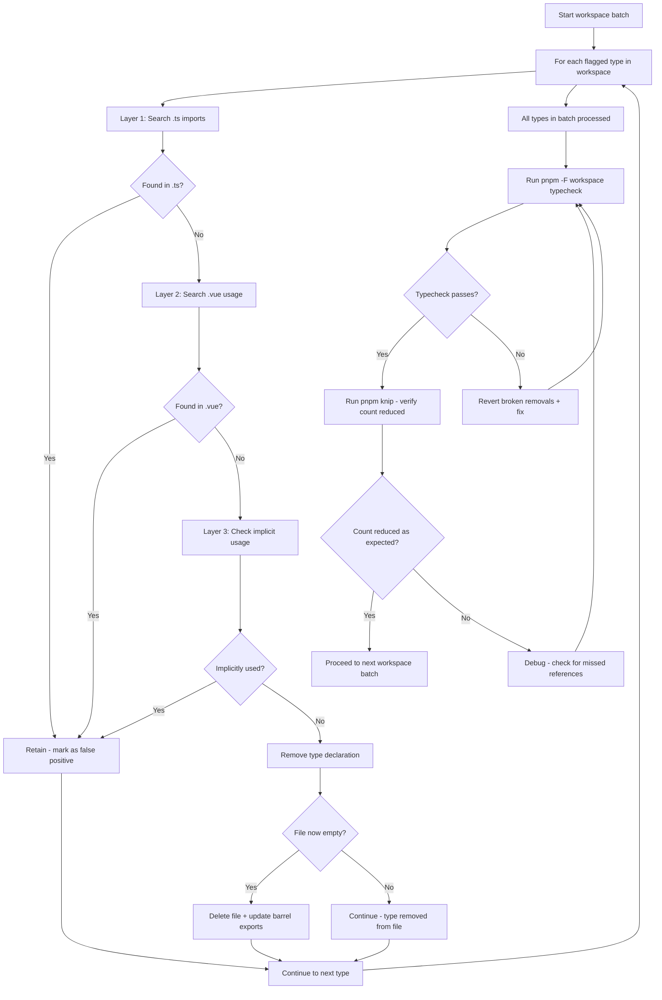

# Knip Cleanup — Unused Exported Types — Design

## Overview

This design covers the systematic analysis and removal of genuinely orphaned exported types across the monorepo. It depends on the [`knip-cleanup-public-api`](.roo/specs/knip-cleanup-public-api/) spec being completed first, which will reduce the initial 116 flagged types by marking `plugin-sdk` and `core-agent` exports as public API.

**Approach:** Workspace-batched progressive cleanup. Each workspace is analyzed as a self-contained batch — verify all its flagged types, remove confirmed orphans, then typecheck before moving to the next workspace. This prevents accumulating breakage across workspaces.

---

## Methodology: Three-Layer Type Verification

Every flagged type must pass through three verification layers before removal:

### Layer 1: Direct `.ts` import search

Search all `.ts` files for explicit `import { TypeName }` or `import type { TypeName }` references. If any `.ts` file imports the type, it is **retained**.

**Tool:** `search_files` with regex pattern `TypeName` across the monorepo.

### Layer 2: Vue SFC usage search

Search all `.vue` files for the type name. Types can appear in:
- `defineProps<TypeName>()` or `defineProps<{ prop: TypeName }>()`
- `defineEmits<TypeName>()`
- `<script setup lang="ts">` import statements
- Generic type parameters in composable calls

If any `.vue` file references the type, it is **retained**.

**Tool:** `search_files` with regex pattern `TypeName` scoped to `*.vue` files.

### Layer 3: Implicit usage check

Check for usage patterns that don't involve direct imports:
- Referenced in `package.json` `exports` declarations (public API surface)
- Used as generic parameter constraints in other exported functions
- Referenced in Valibot/Zod schema inference (`v.infer<typeof Schema>`)
- Used in `extends` clauses of other exported types

If any implicit usage is found, it is **retained**.

**Tool:** `read_file` to inspect the type's source file and trace references.

---

## D1: Capture Reduced Flagged Types List

**Prerequisite:** [`knip-cleanup-public-api`](.roo/specs/knip-cleanup-public-api/) spec must be completed and merged first.

**Action:** Run `pnpm knip` and capture the full list of remaining unused exported types. Group them by workspace for batch processing.

**Expected workspaces with flagged types:**
- `packages/stage-ui` — largest expected batch (component prop types, store state types)
- `packages/stage-ui-three` — Three.js binding types
- `packages/stage-layouts` — layout configuration types
- `apps/stage-tamagotchi` — Electron IPC contract types, store types
- Other workspaces — smaller batches

---

## D2: Workspace-Batched Analysis and Removal

Each workspace follows the same sub-process:

### D2.1: packages/stage-ui batch

**Expected:** Largest batch. Many component prop interfaces and store state types are used exclusively in `.vue` files. Expect high false-positive rate.

**Strategy:** Focus on types that are clearly internal utility types (not prop/state interfaces). Prop interfaces like `XProps` and state types like `XState` are almost certainly used in `.vue` files and should be retained without deep analysis.

### D2.2: packages/stage-ui-three batch

**Expected:** Small batch. Three.js binding types may be used in component props.

**Strategy:** Verify against `ThreeScene.vue`, `VRMModel.vue`, `SkyBox.vue`, `OrbitControls.vue`.

### D2.3: packages/stage-layouts batch

**Expected:** Small batch. Layout configuration types may be used in layout `.vue` files.

**Strategy:** Verify against layout component files.

### D2.4: apps/stage-tamagotchi batch

**Expected:** Medium batch. Electron IPC contract types may be used across main/renderer boundary.

**Strategy:** Verify against both `src/main/` and `src/renderer/` source files. Pay special attention to Eventa contract types that cross the IPC boundary.

### D2.5: Other workspaces batch

**Expected:** Small scattered batches across remaining workspaces.

**Strategy:** Apply the same three-layer verification to each.

---

## D3: Final Verification

After all workspace batches are complete:

1. `pnpm install` — ensure lockfile consistency
2. `pnpm -F @proj-airi/stage-ui typecheck` — confirm no type errors
3. `pnpm -F @proj-airi/stage-ui-three typecheck` — confirm no type errors
4. `pnpm -F @proj-airi/stage-tamagotchi typecheck` — confirm no type errors
5. `pnpm -F @proj-airi/plugin-sdk typecheck` — confirm no type errors
6. `pnpm -F @proj-airi/core-agent typecheck` — confirm no type errors
7. `pnpm knip` — verify significantly reduced "unused exported types" count
8. `pnpm lint` — confirm no lint issues

---

## Task Structure

Tasks are organized as workspace batches. Each batch contains:
- **T{batch}.0** — Run `pnpm knip` and capture flagged types for this workspace
- **T{batch}.1–N** — For each type: verify (3 layers) → remove or retain
- **T{batch}.V1** — Run `pnpm -F <workspace> typecheck` after batch completion
- **T{batch}.V2** — Run `pnpm knip` to verify count reduction

The exact task count per batch depends on how many types remain after the [`knip-cleanup-public-api`](.roo/specs/knip-cleanup-public-api/) spec reduces the initial 116. Task IDs will be filled in during implementation when the actual type list is captured.