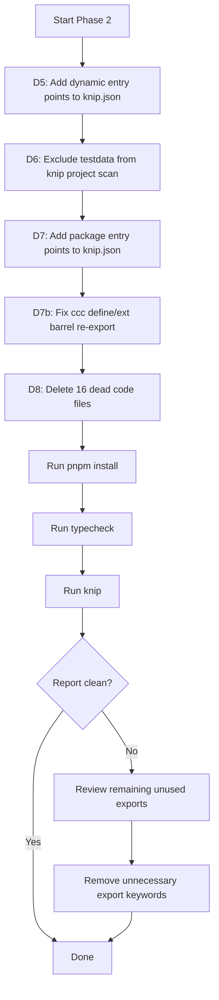

# Knip Cleanup — Design (Phase 2)

## Approach

Phase 1 resolved the bulk of false positives by adding Vue page/layout entry patterns and removing unused dependencies. Phase 2 addresses the remaining 29 unused files and 58 unused exports through four distinct change areas, each targeting a specific category identified in the investigation.

## Change Areas

### D5: Add Dynamic Entry Points to knip.json (Category A)

**Target file:** [`knip.json`](knip.json)

**Strategy:** Two files are actively used at runtime but loaded via string paths that Knip cannot trace statically. Add them to the `entry` array in their respective workspace configurations.

**Changes to `apps/stage-tamagotchi` workspace entry:**

```json
"entry": [
  "src/main/index.ts",
  "src/preload/index.ts",
  "src/renderer/main.ts",
  "src/renderer/beat-sync.main.ts",
  "src/renderer/pages/**/*.vue",
  "src/renderer/layouts/**/*.vue",
  "src/preload/beat-sync.ts"
]
```

**Add `packages/stage-ui-live2d` workspace with entry:**

```json
"packages/stage-ui-live2d": {
  "entry": [
    "src/utils/live2d-structure-report.ts"
  ],
  "project": [
    "src/**/*.ts",
    "src/**/*.vue"
  ]
}
```

**Rationale:** [`src/preload/beat-sync.ts`](apps/stage-tamagotchi/src/preload/beat-sync.ts) is referenced as a compiled string path `../preload/beat-sync.mjs` in [`src/main/windows/beat-sync/index.ts`](apps/stage-tamagotchi/src/main/windows/beat-sync/index.ts:13). [`src/utils/live2d-structure-report.ts`](packages/stage-ui-live2d/src/utils/live2d-structure-report.ts) is a standalone CLI script invoked directly from the command line, not imported by any module.

---

### D6: Exclude Test Data from Knip Project Scan (Category B)

**Target file:** [`knip.json`](knip.json)

**Strategy:** The `testdata/` directory in `packages/plugin-sdk` contains test fixture files that are only imported during Vitest runs via dynamic `join(import.meta.dirname, ...)` path construction. Knip cannot trace these dynamic imports. Exclude them from the project scan using negation patterns.

**Changes to `packages/plugin-sdk` workspace:**

```json
"packages/plugin-sdk": {
  "project": [
    "src/**/*.ts",
    "!src/**/testdata/**"
  ]
}
```

**Rationale:** The four testdata files (`test-error-plugin.ts`, `test-injected-host-apis-plugin.ts`, `test-no-connect-plugin.ts`, `test-normal-plugin.ts`) are legitimate test fixtures imported via [`join(import.meta.dirname, 'testdata', ...)`](packages/plugin-sdk/src/plugin-host/core.test.ts:65) in [`core.test.ts`](packages/plugin-sdk/src/plugin-host/core.test.ts). Knip's Vitest integration traces test file imports but cannot resolve dynamically-constructed paths.

---

### D7: Add Package Entry Points to knip.json (Category C)

**Target file:** [`knip.json`](knip.json)

**Strategy:** Several workspace configurations in [`knip.json`](knip.json) only define `project` patterns but lack `entry` arrays. Without an entry point, Knip treats every exported symbol as potentially unused because it doesn't know which files constitute the package's public API surface. Add `entry` arrays pointing to each package's main barrel file.

**Changes:**

| Workspace | Entry to Add | Reason |
|-----------|-------------|--------|
| `packages/plugin-sdk` | `"entry": ["src/index.ts"]` | [`src/index.ts`](packages/plugin-sdk/src/index.ts) re-exports plugin contracts; [`src/channels/index.ts`](packages/plugin-sdk/src/channels/index.ts) exports `channels`, `setActiveHostChannel`, `setActiveDataChannel` — public API |
| `packages/core-agent` | `"entry": ["src/index.ts"]` | [`src/index.ts`](packages/core-agent/src/index.ts) re-exports from messages, runtime, session; [`src/messages/index.ts`](packages/core-agent/src/messages/index.ts) is a barrel for compaction/projection/render/types |
| `packages/stage-ui-three` | `"entry": ["src/index.ts"]` | [`src/index.ts`](packages/stage-ui-three/src/index.ts) re-exports from composables, stores, trace, utils; [`src/composables/index.ts`](packages/stage-ui-three/src/composables/index.ts) is a barrel for shader/vrm |
| `packages/ccc` | `"entry": ["src/index.ts"]` | [`src/index.ts`](packages/ccc/src/index.ts) re-exports from define, export, utils; [`src/define/ext.ts`](packages/ccc/src/define/ext.ts) exports `defineExt` and `Ext` type but is NOT re-exported from [`src/define/index.ts`](packages/ccc/src/define/index.ts) — this is a genuine missing re-export that should also be fixed |

**Additional fix for `packages/ccc`:** [`src/define/ext.ts`](packages/ccc/src/define/ext.ts) exports `defineExt` and the `Ext` type, but [`src/define/index.ts`](packages/ccc/src/define/index.ts) only re-exports `Card` and `defineCard` from `card.ts`. The `Ext` type and `defineExt` function should be added to the barrel:

```ts
// packages/ccc/src/define/index.ts
export { type Card, defineCard } from './card'
export { type Ext, defineExt } from './ext'
```

**Rationale:** When a workspace has no `entry`, Knip has no anchor to start tracing imports from. Every export in every file becomes a candidate for "unused" because Knip doesn't know which exports form the package's intended public surface. Adding `src/index.ts` as the entry tells Knip: "anything reachable from this file is used; anything not reachable is potentially dead."

---

### D8: Delete Genuine Dead Code (Category D)

**Strategy:** 16 files have zero imports anywhere in the workspace and are not dynamically loaded. Delete them.

#### apps/stage-tamagotchi (9 files)

| File | Reason for Deletion |
|------|---------------------|
| [`src/main/services/electron/system-preferences.ts`](apps/stage-tamagotchi/src/main/services/electron/system-preferences.ts) | `createSystemPreferencesService` — zero imports in workspace |
| [`src/main/windows/dashboard/index.ts`](apps/stage-tamagotchi/src/main/windows/dashboard/index.ts) | `setupDashboardWindow` not imported in [`src/main/index.ts`](apps/stage-tamagotchi/src/main/index.ts:41); dashboard window is dead |
| [`src/main/windows/dashboard/rpc/index.electron.ts`](apps/stage-tamagotchi/src/main/windows/dashboard/rpc/index.electron.ts) | Only imported by dead dashboard/index.ts — cascade delete |
| [`src/main/windows/shared/persistence.ts`](apps/stage-tamagotchi/src/main/windows/shared/persistence.ts) | Re-export barrel from `../../libs/electron/persistence` — zero imports |
| [`src/renderer/components/IconAnimation.vue`](apps/stage-tamagotchi/src/renderer/components/IconAnimation.vue) | Zero imports found |
| [`src/renderer/components/stage-islands/resource-status-island/loading-component-detail.vue`](apps/stage-tamagotchi/src/renderer/components/stage-islands/resource-status-island/loading-component-detail.vue) | Zero imports found |
| [`src/renderer/composables/icon-animation.ts`](apps/stage-tamagotchi/src/renderer/composables/icon-animation.ts) | `useIconAnimation` — zero imports from other files |
| [`src/renderer/stores/window.ts`](apps/stage-tamagotchi/src/renderer/stores/window.ts) | `useWindowStore` — zero imports found |
| [`src/renderer/utils/windows.ts`](apps/stage-tamagotchi/src/renderer/utils/windows.ts) | Stub `startClickThrough`/`stopClickThrough` — zero imports |

**Note on dashboard directory:** The entire [`src/main/windows/dashboard/`](apps/stage-tamagotchi/src/main/windows/dashboard/) directory should be deleted since both files within it are dead. The [`src/main/windows/shared/persistence.ts`](apps/stage-tamagotchi/src/main/windows/shared/persistence.ts) barrel is also dead — consumers import directly from [`src/main/libs/electron/persistence`](apps/stage-tamagotchi/src/main/libs/electron/persistence) instead.

**Note on icon-animation cluster:** [`IconAnimation.vue`](apps/stage-tamagotchi/src/renderer/components/IconAnimation.vue), [`icon-animation.ts`](apps/stage-tamagotchi/src/renderer/composables/icon-animation.ts) form a dead cluster — the composable is only used by the component, and neither is imported externally.

#### packages/plugin-sdk (4 files)

| File | Reason for Deletion |
|------|---------------------|
| [`src/plugin/local.ts`](packages/plugin-sdk/src/plugin/local.ts) | Barrel re-export — zero imports |
| [`src/plugin/local/index.ts`](packages/plugin-sdk/src/plugin/local/index.ts) | Empty stub with TODO — zero imports |
| [`src/plugin/remote.ts`](packages/plugin-sdk/src/plugin/remote.ts) | Barrel re-export — zero imports |
| [`src/plugin/remote/index.ts`](packages/plugin-sdk/src/plugin/remote/index.ts) | Empty stub with TODO — zero imports |

**Note:** These are placeholder stubs with TODO comments indicating incomplete implementation. They should be deleted since no code references them.

#### packages/stage-ui (3 files)

| File | Reason for Deletion |
|------|---------------------|
| [`src/components/animations/Replayable.vue`](packages/stage-ui/src/components/animations/Replayable.vue) | Zero imports from other files |
| [`src/utils/relative-time.ts`](packages/stage-ui/src/utils/relative-time.ts) | `formatRelativeTime` — zero imports |
| [`src/utils/stream.ts`](packages/stage-ui/src/utils/stream.ts) | `ControllableStream`/`createControllableStream` — zero imports |

**Note on Replayable.vue:** The companion composable [`use-replayable.ts`](packages/stage-ui/src/components/animations/use-replayable.ts) IS imported by [`Replayable.vue`](packages/stage-ui/src/components/animations/Replayable.vue) itself, but since Replayable.vue is dead, the composable becomes dead too. However, Knip may not flag `use-replayable.ts` separately since it's only used internally within the dead component. Verify after deletion whether `use-replayable.ts` should also be removed.

---

### D9: Verification

After all changes:

1. Run `pnpm install` to ensure lockfile consistency
2. Run `pnpm -F @proj-airi/stage-tamagotchi typecheck` to confirm no type errors from file deletions
3. Run `pnpm knip` and verify:
   - Category A, B, C files are no longer flagged
   - Category D files are gone (deleted)
   - Remaining unused exports count drops significantly
4. Review any remaining unused exports and remove unnecessary `export` keywords from internally-used functions

## Flow Diagram



## Risk Assessment

| Risk | Mitigation |
|------|------------|
| Deleting a file that is dynamically loaded at runtime | All Category D files were verified with `search_files` — zero imports found across the entire workspace |
| Dashboard window might be re-enabled in future | Dashboard code is clearly dead — not imported in main index.ts. If needed later, it can be restored from git history |
| Removing `export` from internally-used functions breaks external consumers | Only remove `export` from functions that Knip confirms are unused AND that have zero external imports. Verify each individually |
| Adding entry points hides genuine unused exports | Entry points only mark the public API surface. After adding entries, remaining flags are genuine dead exports |
| `use-replayable.ts` becomes orphaned after Replayable.vue deletion | Verify after deletion; remove if Knip flags it |
| `packages/ccc` define/ext re-export change affects downstream | `defineExt` and `Ext` are currently unreachable from the package root, so adding them to the barrel is a net improvement with zero breakage risk |